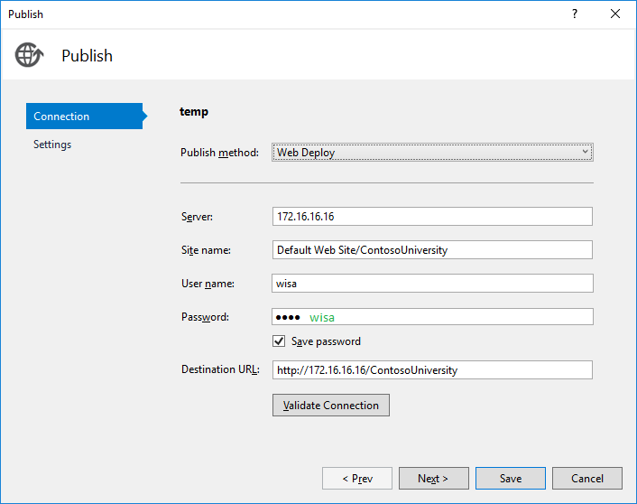

This repository contains the installation of a WISA-Stack, automated with Vagrant and PowerShell. The VagrantBox is a clean Windows Server 2016 and uses the belgian period format.

# Configurable components

All Configurable components are listed in the `config.yml`-file. Most are self-explanatory, but below is a short explanation.

* **ip-address:** The ip-address of the virtual machine

* **virtualbox:**
    * **name:** Name of the virtual machine in Virtualbox
    * **cpus:** Number of virtual processors
    * **memory:** The amount of virtual memory (RAM)
    * **gui:** Display the gui, if disabled: run headless

* **iis:**
    * **username:** Username of the iis-user. When left empty, "wisa" is used.
    * **password:** Password of the iis-user. When left empty, "wisa" is used.
    * **downloadpath:** Downloadpath of the extra iis install files. When left empty, "C:\SetupMedia" is used.

* **asp:**
    * true and false have to be preceded by a dollarsign ($), this is requisite in Powershell
    * **asp35:** Install ASP.NET 3.5 (and lower)
    * **asp45:** Install ASP.NET 4.5 (and higher)

* **sql:**
    * **downloadpath:** Downloadpath of the extra SQL install files. When left empty, "C:\SetupMedia" is used.
    * **instancename:** SQL-Server instancename. When left empty, "SQLEXPRESS" is used.
    * **rootpassword:** Password of root-user "sa". When left empty, "root" is used.
    * **tcpportnr:** TCP-port where the database will be accessible from. Has to be between 49152 and 65535.
    * **dbname:** Name of the database, owned by the developer user. When left empty, "wisa" is used.
    * **username:** Name of the developer user. When left empty, "wisa" is used.
    * **password:** Password of the developer user. When left empty, "wisa" is used.

* **folders:**
    * **provision:** Location of the Powershell scripts.

# How to publish through Visual Studio

The images below are self-explanatory, but you can [download](https://code.msdn.microsoft.com/ASPNET-Web-Deployment-c2d409f9) an example project from Microsoft to test your setup. Don't forget to change the `Web.config`, possibly with [transforms](https://msdn.microsoft.com/en-GB/Library/dd465326(VS.100).aspx)):

*Connectionstring for the 2 databases is the same. Do note the comma instead of the colon to specify the port number*

*To avoid conflicts, disable "Include all databases configured in Package/Publish SQL tab" after initial publication.*

# Connect to the databases

Open Microsoft SQL Server Management Studio with following parameters (in case of standard yaml-file):
* *Server name:* `172.16.16.16,50000`
* *Authentication:* `SQL Server Authentication`
* *Login:* `wisa` (user) or `sa` (administrator)
* *Password:* `wisa` and `root` respectively
